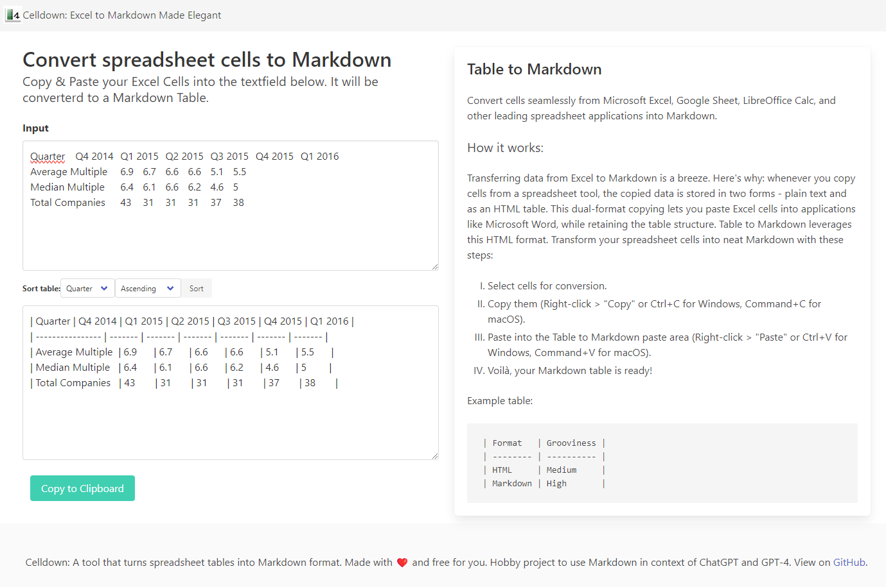

[](https://app.netlify.com/sites/resplendent-bublanina-0568de/deploys)

# Celldown
A small tool that swiftly converts spreadsheet tables into neat Markdown format.
Table to Markdown is designed to help users transform tables from spreadsheet applications and websites into well-formatted Markdown tables with ease. Whether you're copying from Microsoft Excel, Google Sheets, or any modern spreadsheet application, Table to Markdown is here to streamline your workflow.
See a [Demo on Netlify](https://resplendent-bublanina-0568de.netlify.app/). 



## Project setup
```
npm install
npm install xlsx
```
This project makes use of the `xlsx` library to handle spreadsheet data.

### Compiles and hot-reloads for development
```
npm run serve
```

### Compiles and minifies for production
```
npm run build
```

### Lints and fixes files
```
npm run lint
```

### Collaboration
We believe in the power of collective intelligence. If you have suggestions, improvements, or want to contribute in any other way, feel free to create a pull request or open an issue. Any and all feedback is appreciated!